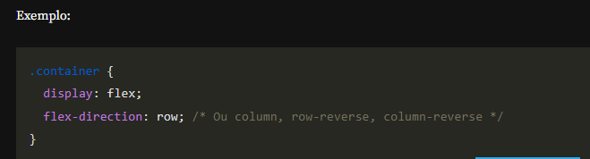
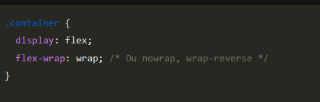
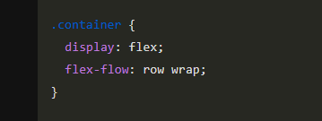
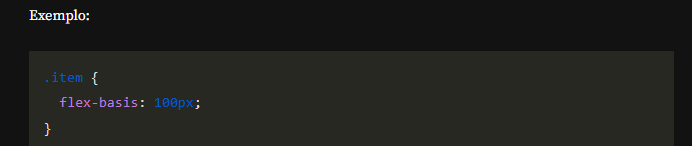

## 
# CSS Flexbox

Página inicial do Luz e Cena.

## 🔨 Funcionalidades do Projeto

A página possui um cabeçalho, um banner, uma lista de filmes, uma seção de newsletter e um rodapé.

## ✔️ Técnicas e Tecnologias Utilizadas

As principais técnicas e tecnologias utilizadas neste projeto são:

- **`HTML`**: Linguagem de marcação utilizada para estruturar o conteúdo das páginas web.
- **`CSS`**: Utilizado para estilizar a apresentação da página web.
  - **`CSS Flexbox`**: Utilizado para organizar elementos de forma flexível e responsiva, garantindo um layout moderno e adaptável. Abaixo estão os principais atributos utilizados do Flexbox:
    - **`display: flex`**: Define um elemento como um container flexível, ativando as propriedades Flexbox para os elementos filhos.
    - **`flex-direction`**: Define a direção principal do layout dos itens flexíveis.
    - **`justify-content`**: Alinha os itens ao longo do eixo principal (horizontal por padrão).
    - **`align-items`**: Alinha os itens ao longo do eixo transversal (vertical por padrão).
    - **`align-content`**: Alinha várias linhas de itens flexíveis quando há espaço extra no eixo transversal. Funciona quando há múltiplas linhas (com `flex-wrap`).
    - **`flex-wrap`**: Define se os itens devem ou não quebrar para a próxima linha.
    - **`flex-flow`**: Combina `flex-direction` e `flex-wrap` em uma única propriedade.
    - **`order`**: Define a ordem dos itens dentro do container flexível.
    - **`flex-grow`**: Define a capacidade de um item flexível de crescer, ocupando o espaço disponível.
    - **`flex-shrink`**: Define a capacidade de um item de encolher caso necessário.
    - **`flex-basis`**: Define o tamanho inicial do item antes de o espaço disponível ser distribuído.
    - **`flex`**: Combina `flex-grow`, `flex-shrink` e `flex-basis` em uma única propriedade para maior simplicidade.
    - **`align-self`**: Permite modificar o alinhamento de um item específico, substituindo o valor definido em `align-items` para aquele item.

Esses atributos são essenciais para criar um layout flexível, garantindo que a página seja responsiva e adaptável a diferentes tamanhos de tela e dispositivos.

## 📁 Acesso ao Projeto

Você pode [acessar o código-fonte do projeto inicial](https://github.com/monicahillman/3992-css-grid/tree/projeto-base) ou [baixá-lo](https://github.com/monicahillman/3992-css-grid/archive/refs/heads/projeto-base.zip).

** Acessando o protótipo do projeto no figma>>> 
https://www.figma.com/design/5R7RVz8QGMuOzJafDPnz5h/CSS--Avan%C3%A7ando-em-flexbox-%7C-Luz---Cena--Community-?node-id=0-1&p=f&t=IB2LvaHWOwTDYJmK-0

## 🛠️ Como Abrir e Rodar o Projeto

Após baixar o projeto, você pode abri-lo no Visual Studio Code. Para isso, siga os passos abaixo:

1. No menu superior do VS Code, clique em:
   * **File > Open Folder** (ou uma opção similar).
2. Procure o local onde o projeto foi salvo e selecione a pasta (se o projeto foi baixado como um arquivo ZIP, será necessário extraí-lo antes).
3. Clique em **OK**.

Após finalizar esses passos, você pode executar a aplicação usando a extensão **Live Server** 🏆. Isso facilitará a visualização do projeto em seu navegador e garantirá que as alterações sejam refletidas automaticamente.

---

## Para saber mais: ordenando itens

No mundo de desenvolvimento web, a criação de layouts responsivos e bem estruturados é essencial para garantir uma boa experiência do usuário em diferentes dispositivos e tamanhos de tela. O CSS Flexbox é uma ferramenta poderosa para isso, permitindo a criação de layouts flexíveis e alinhados com facilidade. Entre as suas propriedades, display: flex e order são particularmente importantes para controlar a disposição e a ordem dos elementos dentro de um contêiner flexível. Este texto explora como essas propriedades podem ser utilizadas para estilizar cabeçalhos, criar navegações flexíveis e responsivas, e ajustar layouts com media queries.

Criar layouts responsivos e bem organizados pode ser desafiador, especialmente quando se trata de alinhar elementos de forma precisa e controlar a ordem em que aparecem na tela. Por exemplo, um cabeçalho pode precisar ser centralizado e ter uma largura máxima, uma lista de navegação deve se adaptar a diferentes tamanhos de tela, e um campo de input de pesquisa deve ser estilizado adequadamente. Além disso, a ordem dos elementos pode precisar ser ajustada para diferentes visualizações, o que pode ser complexo sem uma abordagem sistemática.

O Flexbox fornece uma maneira mais eficiente e intuitiva de distribuir espaço e alinhar itens em um contêiner, mesmo quando o tamanho dos itens é desconhecido ou dinâmico.

**display: flex:** Define o contêiner como um contêiner flexível, ativando as propriedades flexbox nos itens filhos. Os itens dentro do contêiner podem ser alinhados e distribuídos facilmente usando propriedades como justify-content, align-items, e flex-direction.

**order:** Permite alterar a ordem visual dos itens dentro de um contêiner flexível sem alterar o HTML. Itens com um valor de order menor aparecem antes dos itens com valores maiores. Isso é útil para ajustar a ordem dos elementos responsivamente.

Exemplo de código usando order:

 
 

>  
> .item1 é exibido em segundo lugar.
>
> .item2 é exibido em primeiro lugar.
>
> .item3 é exibido em terceiro lugar.

Combinando essas propriedades com media queries, você pode criar layouts adaptáveis que mantêm a funcionalidade e a estética em diferentes dispositivos e tamanhos de tela.

---- 

###  rem (relative to the root element)
A unidade rem é sempre relativa ao tamanho da fonte do elemento raiz (html), independentemente da hierarquia.
Isso torna o uso de rem mais previsível e consistente.

## em (relative to the element's own font size)
A unidade em é relativa ao tamanho da fonte do elemento pai (ou do próprio elemento, dependendo do contexto).
Isso significa que ela pode se acumular em elementos aninhados, o que pode levar a efeitos inesperados 
se não for bem controlada.

## Unidades de Medida
https://www.alura.com.br/artigos/guia-de-unidades-no-css

---

## Para saber mais: alinhando elementos

No design de layouts responsivos e bem estruturados, a utilização do Flexbox é crucial para um controle preciso sobre a disposição dos elementos.

Problemas comuns incluem a necessidade de alinhar o conteúdo centralmente e ajustar a disposição dos elementos conforme o espaço disponível. Sem uma abordagem sistemática, pode ser difícil obter o alinhamento e a organização desejados, especialmente em diferentes tamanhos de tela.

Entre as propriedades mais importantes do Flexbox estão flex-direction, justify-content e align-items, que permitem organizar e alinhar os itens dentro de um contêiner flexível.

**flex-direction:** Controla a direção principal dos itens em um contêiner flexível. Os valores possíveis incluem row (padrão), column, row-reverse e column-reverse. O valor column organiza os itens verticalmente, o que é útil para layouts onde a empilhamento vertical é desejado.

**justify-content:** Alinha os itens ao longo do eixo principal do contêiner, que é vertical quando flex-direction está definido como column. Os valores incluem flex-start, center, flex-end, space-between, space-around e space-evenly. No caso de center, os itens são centralizados ao longo do eixo principal.

**align-items:** Alinha os itens ao longo do eixo transversal do contêiner. Com flex-direction: column, o eixo transversal é horizontal. Os valores incluem flex-start, center, flex-end, baseline e stretch. Com flex-start, os itens são alinhados ao início do eixo transversal, que é à esquerda no caso de uma direção de coluna.

Combinando essas propriedades, é possível criar layouts flexíveis e bem organizados, que se adaptam a diferentes tamanhos de tela e contextos de design.

--- 

## Para saber mais: flex grow, shrink e basis
 

Ao trabalhar com layouts responsivos em CSS, o Flexbox é uma das ferramentas mais poderosas e flexíveis para criar interfaces dinâmicas. No entanto, entender como elementos dentro de um contêiner flexível se comportam pode ser desafiador. Propriedades como flex-grow, flex-shrink e flex-basis desempenham papéis essenciais na distribuição do espaço, mas podem ser confusas para muitos desenvolvedores.

Imagine um cenário onde você possui vários itens dentro de um contêiner flexível, e deseja que alguns itens cresçam mais do que outros ou encolham de forma diferente quando o espaço disponível é redimensionado. O Flexbox, por meio das propriedades flex-grow, flex-shrink e flex-basis, oferece uma solução precisa para controlar o comportamento dos elementos. Usando essas propriedades, podemos definir:

Como os itens crescem quando há espaço extra (flex-grow),
Como encolhem quando há espaço insuficiente (flex-shrink),
E qual será o tamanho base de um item (flex-basis).

1. flex-grow
A propriedade flex-grow define quanto um item pode crescer em relação aos outros quando há espaço extra no contêiner flexível. Se todos os itens tiverem flex-grow: 1, eles crescerão igualmente. No entanto, se um item tiver flex-grow: 2, ele ocupará o dobro do espaço extra em relação a um item com flex-grow: 1.
Neste caso, o item com flex-grow: 2 crescerá duas vezes mais do que os outros.

2. flex-shrink
A propriedade flex-shrink controla como os itens encolhem quando o espaço é reduzido. Um valor maior de flex-shrink permite que o item encolha mais do que os outros. Por padrão, a maioria dos itens tem flex-shrink: 1, o que significa que encolhem proporcionalmente. Se um item tiver flex-shrink: 0, ele não encolherá.

Aqui, o item com flex-shrink: 0 permanecerá do mesmo tamanho, mesmo quando o espaço no contêiner for reduzido.

3. flex-basis
A propriedade flex-basis define o tamanho inicial de um item antes de o espaço restante ser distribuído. Ela pode ser definida como um valor fixo (por exemplo, 200px) ou como um valor relativo (por exemplo, auto).

Neste caso, o item começará com 100px de largura, e depois poderá crescer ou encolher com base nas outras propriedades (flex-grow e flex-shrink).

Compreender e usar flex-grow, flex-shrink e flex-basis permite criar layouts flexíveis e responsivos com precisão. Ao dominar essas propriedades, você poderá ajustar o comportamento dos seus elementos de forma eficiente, garantindo que seu design funcione bem em qualquer tamanho de tela.